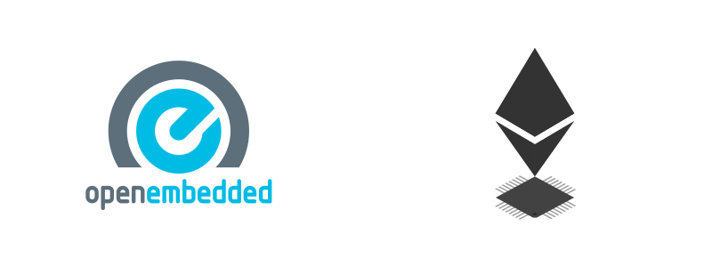

# meta-ethereum



The upcoming wave of blockchain-enabled IoT devices is creating a rising demand for embedded support of the [Ethereum](https://www.ethereum.org/) protocol. Examples of projects that aim to run Ethereum inside embedded systems are:

 * **Ethereum on ARM**: <https://ethereum-on-arm-documentation.readthedocs.io>
 * **EthRaspbian**: <https://ethraspbian.com>
 * **cpp-ethereum-cross**: <https://github.com/doublethinkco/cpp-ethereum-cross/>
 * **EthEmbedded**: <http://ethembedded.com>
 * **Oaken Project**: <https://www.oakeninnovations.com/>

The [**Yocto Project**](https://www.yoctoproject.org/) is an open source collaboration project that helps developers create custom Linux-based systems regardless of the hardware architecture. Meanwhile, [**OpenEmbedded**](http://www.openembedded.org/wiki/Main_Page) is a build automation framework and cross-compile environment used to create Linux distributions for embedded devices.

Together, these projects provides a flexible set of tools and a space where embedded developers worldwide can share technologies, software stacks, configurations, and best practices that can be used to create tailored Linux images for embedded and IoT devices, or anywhere a customized Linux OS is needed.

The **meta-ethereum** OpenEmbedded Layer aims to provide recipes for Ethereum related programs, tools and libraries in order to support the Ethereum blockchain on a large variety of embedded devices. Please note that the meta-* is an OE layer naming convention, and this repository has nothing to do with the [Ethereum Meta](https://ethermeta.com/) project.

Currently, we aim to provide recipes for the following:

 * **go-ethereum**: <https://github.com/ethereum/go-ethereum>:
   - `geth`
   - `clef`
   - `devp2p`
   - `abigen`
   - `bootnode`
   - `evm`
   - `rlpdump`
   - `puppeth`
 * **OpenEthereum**: <https://github.com/openethereum/openethereum>:
   - `openethereum`
   - `evmbin`
   - `ethstore`
   - `ethkey`
   - `ethabi`
   - `whisper`
 * **Nimbus**: <https://github.com/status-im/nimbus-eth2>
   - `nimbus_beacon_node`
   - `nimbus_validator_client`
   - `nimbus_signing_process`
   - `nbench`
   - `ncli`
   - `ncli_db`
 * **Trinity**: <https://trinity.ethereum.org/>
   - `trinity`

Any collaborations (issues, patches, pull requests, suggestions) are more than welcome: <barodrigues@protonmail.com>

---
## Dependencies

The meta-ethereum layer depends on:

```
	URI: git://git.openembedded.org/openembedded-core
	layers: meta
	branch: hardknott

  URI: git://github.com/meta-rust/meta-rust
  layers: meta-rust
  branch: master

  URI: git://github.com/oe-nim/meta-nim
  layers: meta-nim
  branch: main
```

---
## Donations
If you find meta-ethereum useful, please consider making a donation:

- **BTC** `1A3bVGz9VWCsngsFZGe78MYEaj82dYFTdh`
- **BCH** `qp3nds93p30pq03yk4eg09a82znd23ezfq299ptuhx`
- **ETH** `0x35cd665c0F6EF207935547aD480E5980131f81FC`
- **Gitcoin Grants**: https://gitcoin.co/grants/2564/oe-eth
---
## License

meta-ethereum is released under the [GPLv3](https://github.com/oe-eth/meta-ethereum/blob/master/LICENSE).
